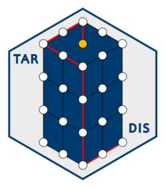

# TARDIS 

TARDIS (Terrains Routes Directed In Spacetime) is a package for spatiotemporal landscape connectivity analysis.

In regular connectivity analysis, the cells of raster grid for a given landscape are converted to vertices in an xy lattice
graph, with the weights of the edges parameterising the ease of travel across the landscape. In palaeontological cases,
these lattices cannot capture the effects of a changing landscape on long-term evolutionary and biogeographic processes.
TARDIS addresses this shortfall by providing methods for constructing xyz lattice graphs from a time-ordered stack of
landscape rasters. 

TARDIS graphs can be thresholded and analysed using any tools applicable to graph analysis to investigate their properties.
Some tools, primarily least cost path detection, are included in the package and more will be added in due course. Please
do get in contact with any ideas/bug reports as TARDIS remains a work in progress.
