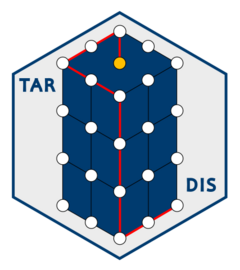

# rTARDIS 

`rTARDIS` (Terrains And Routes Directed In Spacetime) is an R package for spatiotemporal geographic connectivity analysis. It provides functions for constructing and analysing graph representations of complex geographic spaces at local to global scales, particularly where accessible spaces are discontinuously distributed but still display connectivity (e.g., island systems where isolation is strong but not necessarily absolute), and where that distribution also changes through time (e.g., habitat patch fragmentation or plate tectonic drift).

`rTARDIS` was primarily designed to allow exploration of routes and distances across changing geographic architectures in deep time - Google Maps for palaeobiologists! Its general functionality, however, is also suitable for modern applications such as landscape genetics or dispersal ecology. As such, suggestions for enhancements or improvements are welcomed.

# Installation

A stable release of `rTARDIS` on CRAN is anticipated in the near future. For the time being, the development version of `TARDIS` can be installed via GitHub using:

```r
# install.packages("devtools")
devtools::install_github("jf15558/rTARDIS")
```

# Citation

If you use the `rTARDIS` R package in your work, please cite the original article describing the package:

Flannery-Sutherland, J., Elsler, A., Farnsworth, A., Lunt, D., Benton, M. (2025). Landscape-explicit phylogeography illuminates the ecographic radiation of early archosauromorph reptiles. *Nature Ecology & Evolution* 9, 1138–1152. DOI: [10.1038/s41559-025-02739-y](https://doi.org/10.1038/s41559-025-02739-y).

Please also cite the package version you are using:

```r
# Get citation
citation("rTARDIS")
# Get citation in BibTex format
toBibtex(citation("rTARDIS"))
```